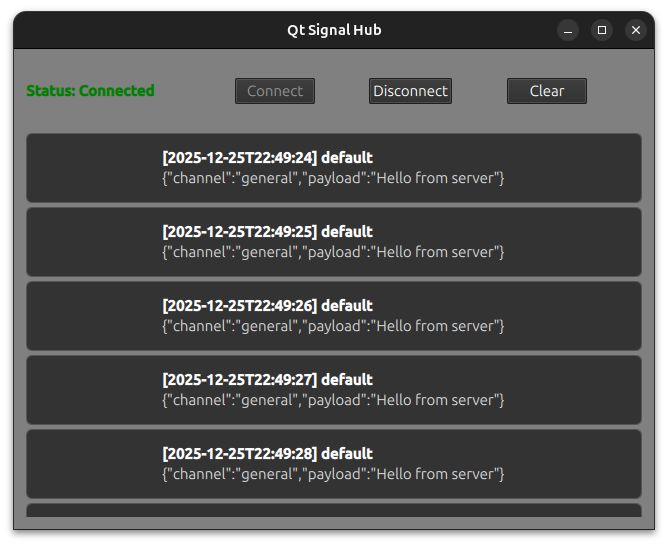

# Qt Signal Hub

Qt Signal Hub is a **Qt 6/QML** desktop application that demonstrates how to build a real-time message feed using a
**C++ backend**, **WebSocket communication**, and a **Qt Quick (QML)** frontend.

The repository also includes a **Python WebSocket test server** used to simulate a real-time message source during
development.

## Screenshot



## Features

- Qt 6.10
- Qt Quick + QML UI
- C++ WebSocket client (`QWebSocket`)
- Real-time message feed
- `QAbstractListModel` exposed to QML
- Centralized application state management
- Strongly typed enums shared between C++ and QML
- Clean separation of UI, networking, and domain logic
- CMake build system
- Keyboard shortcuts
    - `Esc` to quit
    - `Alt + Enter` to toggle fullscreen

## Architecture Overview

Qt Signal Hub follows a **controller + services + models** architecture, keeping responsibilities clear and testable.

```bash
WebSocket Server (Python)
↓
WebSocketClient (C++)
↓
ConnectionManager
↓
MessageRouter / AppState
↓
MessageFeedModel (QAbstractListModel)
↓
QML ListView UI
```

## Networking

### WebSocket Client (C++)

- Uses `QWebSocket` for real-time communication
- Handles connection lifecycle (connect, disconnect, errors)
- Emits received messages via Qt signals
- Designed behind an `IConnectionClient` interface for extensibility

## Application State

### AppState

`AppState` is a lightweight QObject exposed to QML that tracks:

- Current connection state (`Disconnected`, `Connecting`, `Connected`, `Error`)
- Human-readable connection status text
- Current error message (if any)

This ensures:
- UI logic stays declarative
- Business logic stays in C++
- Enums are strongly typed and shared safely between layers

## Models

### MessageFeedModel

- Subclasses `QAbstractListModel`
- Stores incoming messages as `MessageItem` structs
- Exposes roles (`channel`, `payload`, `timestamp`) to QML
- Includes a `count` property for UI bindings
- Supports clearing and max-size truncation

This mirrors real-world patterns used for:
- Chat feeds
- Event logs
- Telemetry dashboards
- Activity streams


## Python Test Server

A simple **Python WebSocket server** is included to simulate a real-time backend during development.

### Features

- Uses `asyncio` + `websockets`
- Sends JSON messages at a fixed interval
- Logs connections and disconnects
- Allows easy testing without a real backend

### Example Message

```json
{
  "channel": "general",
  "payload": "Hello from server"
}
```

### Running the Server

```bash
python test_server.py
```

The server runs on: 

```bash
ws://localhost:12345
```

## Project Structure

```bash

QtSignalHub/
│
├── src/
│   ├── app/
│   │   ├── AppController.h/.cpp
│   │   └── AppState.h/.cpp
│   │
│   ├── network/
│   │   ├── ConnectionManager.h/.cpp
│   │   ├── WebSocketClient.h/.cpp
│   │   ├── IConnectionClient.h
│   │   └── ConnectionTypes.h
│   │
│   ├── models/
│   │   ├── MessageFeedModel.h/.cpp
│   │   └── MessageItem.h
│   │
│   ├── services/
│   │   ├── MessageRouter.h/.cpp
│   │   └── MessageParser.h/.cpp
│   │
│   ├── workers/
│   │   └── ParsingWorker.h/.cpp
│   │
│   └── main.cpp
│
├── qml/
│   ├── Main.qml
│   ├── views/
│   │   ├── ConnectionView.qml
│   │   └── FeedView.qml
│   │
│   └── components/
│       └── MessageCard.qml
│
├── test_server.py
├── CMakeLists.txt
├── README.md
└── docs/
    └── screenshots/
```

## Key Components

### AppController

- Central composition root
- Owns core services and models
- Exposes C++ objects to QML via context properties

### ConnectionManager

- Manages active connection client
- Tracks and updates connection state
- Forwards messages to the routing layer

### MessageFeedModel

- QML-facing data model
- Efficient incremental updates
- Safe model reset and truncation

## Getting Started

**Prerequisites**
- Qt 6.x with QtQuick, QtQuick.Controls, and QtQuick.Layouts
- C++17 or newer
- CMake (if building with CMake) or Qt Creator
- Python 3.10+ (for test server)
- `python3-venv` package installed (Linux)

**Build Instructions**
1. Clone the repository:
```bash
git clone https://github.com/dtb1996/qt-service-lab.git
cd qt-service-lab
```
2. Open the project in Qt Creator:
    - `File → Open File or Project → select CMakeLists.txt`
3. Build and run the project.

**Running the Python WebSocket Test Server**

The Python test server uses the websockets package, which must be installed in a virtual environment due to
modern Python packaging restrictions (PEP 668).

1. Create a virtual environment

From the project root:
```bash
python3 -m venv venv
```

2. Activate the virtual environment
```bash
source venv/bin/activate
```

Your shell prompt should now indicate that the venv is active.

3. Install dependencies
```bash
pip install websockets
```

4. Run the test server
```bash
python test_server.py
```

You should see output similar to:
```bash
WebSocket server running on ws://localhost:12345
```

5. Connect from the Qt app
    - Launch the Qt Signal Hub application
    - Click Connect
    - Incoming messages should appear in the message feed

**Notes**

- The virtual environment only needs to be created once
- Reactivate it (source venv/bin/activate) any time you want to run the test server
- The Qt application does not depend on Python and can be run independently

## Purpose of the Project

This project intentionally demonstrates:
- Real-world Qt/C++ patterns used in production
- Clean separation between UI and logic
- Strong typing across C++ and QML
- Model-driven UI updates
- Practical WebSocket integration
